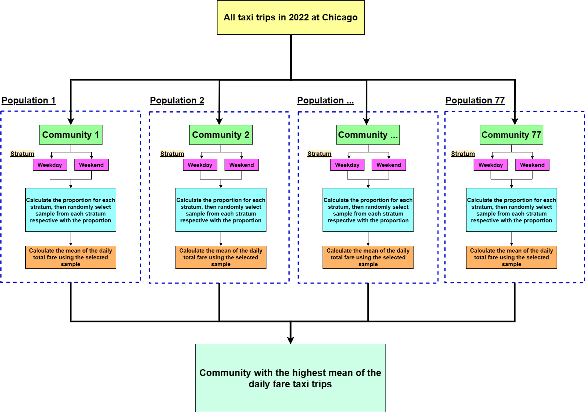

# Analysis of Daily Taxi Trips in Chicago Communities in 2022

In this project, my aim to conduct a comprehensive analysis of historical taxi trips in Chicago during 2022. The primary goal of this analysis is to identify communities with high demand for taxi services, enabling our company to make informed decisions regarding resource allocation and strategic planning. By doing so, we hope to foster growth and attract more customers in 2023.

Given that the dataset from bigquery-public-data.chicago_taxi_trips.taxi_trips dataset may not include every taxi trip taken in the city, it is crucial to ensure that our analysis is as representative as possible. To achieve this, I employ statistical sampling methods, specifically stratified sampling. This approach allows us to account for potential discrepancies in the data and to generate reliable insights into the distribution of taxi trips across Chicago's communities.

Below it's my stratified sampling design for this project.  

